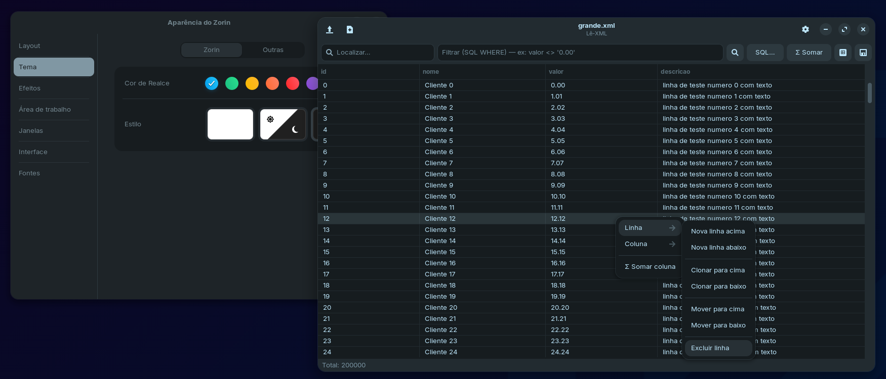
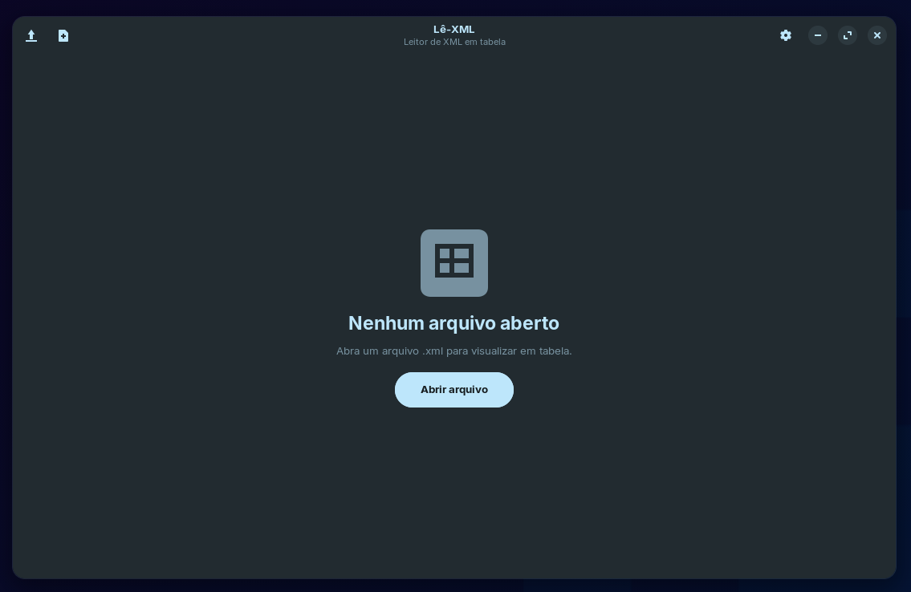
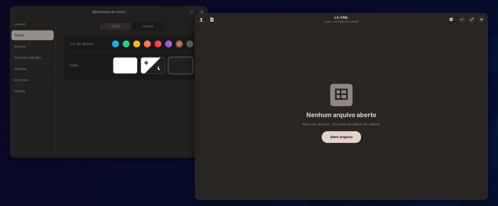

# Lê-XML

Leitor e editor de XML em formato de tabela para Linux, desenvolvido em Rust
com GTK4. O Lê-XML abre arquivos `DATAPACKET`, apresenta os registros em uma
grade editável e permite pesquisar, filtrar, consultar com SQL, reorganizar
linhas e colunas, somar valores, salvar em XML e exportar para CSV.

Arquivos XML que não possuem a estrutura tabular esperada são abertos em um
editor de texto simples.



## Recursos

- abertura rápida, com leitura do XML fora da thread da interface;
- uma janela por documento;
- criação de documento tabular em branco;
- pesquisa de texto em todas as células;
- filtros com expressões SQL `WHERE` e autocompletar de colunas;
- consultas SQL completas com resultado somente leitura na interface;
- edição de células e navegação por teclado;
- inclusão, clonagem, movimentação e exclusão de linhas;
- inclusão, renomeação e exclusão de colunas;
- soma de colunas com números em formato decimal ou brasileiro;
- salvamento em XML e exportação em CSV UTF-8;
- interface em português ou inglês;
- tema claro, escuro ou seguindo o sistema;
- modo texto para XMLs sem estrutura `DATAPACKET`.

## Interface e integração visual

A tela inicial mantém as ações principais no cabeçalho e oferece acesso direto
à abertura de um XML:



Por usar GTK4 puro, o aplicativo acompanha o tema GTK e a cor de destaque
disponíveis no ambiente. No exemplo abaixo, a alteração feita na aparência do
Zorin é refletida pelo Lê-XML:



## Formato tabular

O modo tabela reconhece documentos com definições em
`METADATA/FIELDS/FIELD` e dados em `ROWDATA/ROW`:

```xml
<?xml version="1.0" encoding="UTF-8"?>
<DATAPACKET Version="2.0">
  <METADATA>
    <FIELDS>
      <FIELD attrname="id" fieldtype="string" WIDTH="10"/>
      <FIELD attrname="nome" fieldtype="string" WIDTH="40"/>
      <FIELD attrname="valor" fieldtype="string" WIDTH="20"/>
    </FIELDS>
    <PARAMS/>
  </METADATA>
  <ROWDATA>
    <ROW id="1" nome="Alpha" valor="10.50"/>
    <ROW id="2" nome="Beta" valor="4.25"/>
  </ROWDATA>
</DATAPACKET>
```

Cada `FIELD` vira uma coluna e cada atributo de `ROW` vira uma célula. Consulte
[Formato XML suportado](docs/formato-xml.md) para conhecer as regras de leitura,
salvamento e preservação.

## Início rápido

Pré-requisitos: Rust e os arquivos de desenvolvimento do GTK 4.12 ou superior.

```bash
cargo build --release
./target/release/lexml-gtk
```

Para abrir um documento diretamente:

```bash
./target/release/lexml-gtk caminho/arquivo.xml
```

As instruções por distribuição estão em
[Compilação e empacotamento](docs/build-e-empacotamento.md).

## Documentação

- [Índice da documentação](docs/README.md)
- [Guia de uso](docs/uso.md)
- [Formato XML suportado](docs/formato-xml.md)
- [Compilação e empacotamento](docs/build-e-empacotamento.md)
- [Arquitetura e desenvolvimento](docs/arquitetura.md)

## Estado do projeto

Versão atual do crate: **0.5.3**.

O aplicativo é voltado ao Linux e utiliza GTK4 puro, sem libadwaita. O SQLite é
compilado junto ao executável por meio da funcionalidade `bundled` do
`rusqlite`.

## Licença

Distribuído sob a [GNU General Public License v3.0 ou posterior](LICENSE).
